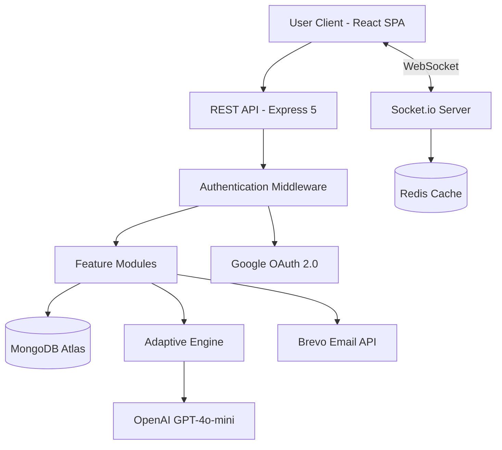
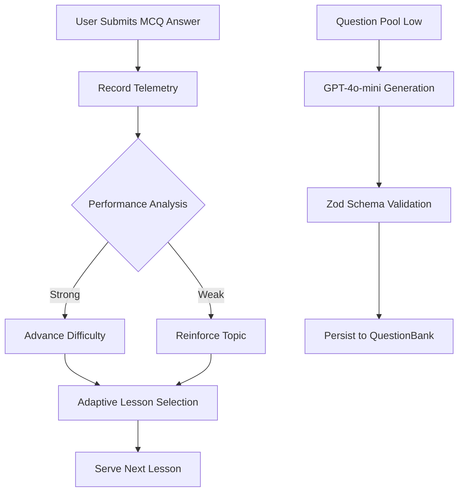
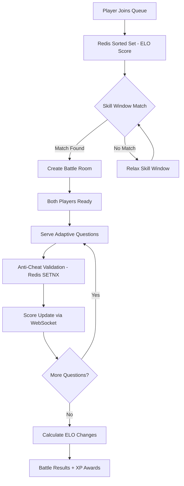
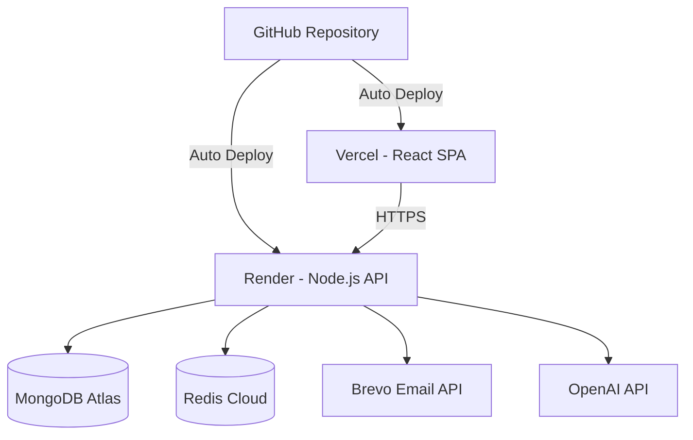

<div align="center">

# MoneyMaster

**Master money management through gamified lessons, real-time quiz battles, and simulated stock trading.**

[](https://finlearnplat.vercel.app)
[](./LICENSE)
[](https://www.typescriptlang.org/)
[](https://react.dev/)
[](https://expressjs.com/)
[](https://www.mongodb.com/atlas)
[](https://socket.io/)
[](https://redis.io/)

*An AI-powered, gamified financial literacy platform — built for young learners ages 5–25.*

</div>

---

## 🌟 Overview

Financial literacy is rarely taught in schools, yet it's one of the most critical life skills. **MoneyMaster** bridges that gap by turning personal finance education into an engaging, game-like experience.

**The Problem** — Young learners lack access to structured, engaging financial education. Traditional resources are dry, disconnected from real-world scenarios, and fail to sustain motivation.

**The Solution** — A full-stack gamified learning platform that combines:
- **Adaptive AI-driven lessons** that personalize content based on individual performance
- **Real-time 1v1 quiz battles** with ELO-based matchmaking for competitive learning
- **Simulated stock trading** to practice investment strategies risk-free
- **XP, achievements, and leaderboards** to drive sustained engagement
- **An AI companion mascot (Rupi)** that guides learners through their journey

**Why It Matters** — MoneyMaster transforms passive learning into active mastery through gamification psychology, adaptive intelligence, and real-time social interaction.

---

## 🚀 Live Demo & Screenshots

<div align="center">

### 🔗 [**Launch MoneyMaster →**](https://finlearnplat.vercel.app)

</div>

| | | |
|:---:|:---:|:---:|
|  |  |  |
| **Landing Page** | **Dashboard** | **Adaptive Lessons** |
|  |  |  |
| **Real-Time Quiz Battles** | **Leaderboard** | **Virtual Wallet & Stocks** |

> **Note:** Replace placeholder paths with actual screenshots. Recommended size: 1280×720px.

---

## 🎯 Target Audience

| Audience | Use Case |
|---|---|
| **Students (Ages 5–25)** | Learn budgeting, saving, investing, and financial planning through gamified modules |
| **Educators & Parents** | Supplement curriculum with an interactive, self-paced financial literacy tool |
| **EdTech Enthusiasts** | Explore a production-grade reference architecture for gamified learning platforms |
| **Developers** | Study a full-stack TypeScript monorepo with real-time systems, adaptive AI, and ELO matchmaking |

---

## ✨ Key Features

### 1. Adaptive Learning Engine (V2)
Server-driven, step-based lessons (info cards + MCQs) that dynamically adapt based on user accuracy, response times, and topic-specific performance telemetry. The system recommends the next optimal lesson in real time.

### 2. Real-Time 1v1 Quiz Battles
WebSocket-powered competitive quiz system with three modes — **Quick Match**, **Ranked**, and **Private Room**. Features ELO-based skill matchmaking, adaptive question selection targeting each player's weak areas, and live score updates.

### 3. ELO Rating & Matchmaking
Standard ELO formula with dynamic K-factors (K=40 new, K=32 standard, K=16 elite). Redis sorted-set queue with composite scoring and skill-window relaxation for fair, fast matchmaking.

### 4. Anti-Cheat System
Redis-backed rate limiting (1 answer per 500ms), answer replay prevention via SETNX locks, tab-switch event recording, and bot-pattern heuristics through response-time variance analysis.

### 5. AI-Powered Question Generation
GPT-4o-mini generates financial literacy questions on demand when the question pool drops below threshold. Output is validated with Zod schemas before persisting to the question bank.

### 6. Simulated Stock Market
Virtual stock trading environment where learners practice buying, selling, and tracking portfolio performance — building real-world investment intuition without risk.

### 7. Gamification Engine
XP leveling system, login streaks, achievement unlocks, virtual wallet with coin rewards, and cross-platform leaderboards to sustain engagement.

### 8. AI Mascot — Rupi
An animated SVG companion with multiple emotional states (waving, celebrating, thinking, sad) that provides contextual guidance, celebrates achievements, and enhances the learning experience with sound effects.

### 9. Comprehensive Authentication
OTP-based email verification (Brevo HTTP API), Google OAuth 2.0, JWT Bearer tokens, and password reset flows — all production-ready.

### 10. Dark/Light Theme
System-aware theme switching with polished glassmorphism UI, smooth gradients, and micro-animations across all pages.

---

## 🏗️ System Architecture

### High-Level System Workflow



---

### AI-Powered Adaptive Learning Pipeline



---

### Real-Time Battle System Flow



---

### Deployment Architecture



---

## ⚙️ Technical Stack

| Layer | Technologies |
|---|---|
| **Frontend** | React 18, TypeScript, Vite 5, Tailwind CSS 3, shadcn/ui, Radix UI Primitives |
| **State Management** | React Context (Auth, Wallet, Progress, Battle, Socket, Mascot), TanStack React Query v5 |
| **Routing & Forms** | React Router v6, React Hook Form, Zod v3 validation |
| **Charts & UI** | Recharts, Lucide Icons, Sonner Toasts, Embla Carousel, next-themes |
| **Backend** | Node.js, Express 5, TypeScript, Zod v4 validation |
| **Real-Time** | Socket.io 4 (server + client), Redis Adapter for horizontal scaling |
| **Database** | MongoDB Atlas, Mongoose 8 ODM |
| **Cache & Pub-Sub** | Redis (ioredis) — matchmaking queue, anti-cheat, Socket.io adapter |
| **AI/ML** | OpenAI GPT-4o-mini — adaptive question generation, Zod-validated output |
| **Authentication** | JWT (jsonwebtoken), Passport.js (Google OAuth 2.0), OTP via Brevo |
| **Email** | Brevo HTTP API (not SMTP — compatible with Render's port restrictions) |
| **Security** | Helmet, CORS, bcryptjs, rate limiting, anti-cheat middleware |
| **Logging** | Pino + pino-pretty (structured JSON logging) |
| **DevOps** | Vercel (frontend), Render (backend), MongoDB Atlas, Redis Cloud |

---

## 📂 Project Structure

```
MoneyMaster/
├── client/                          # React SPA (Vite + TypeScript)
│   ├── src/
│   │   ├── components/
│   │   │   ├── mascot/              # Rupi AI companion (SVG + states)
│   │   │   └── ui/                  # shadcn/ui component library
│   │   ├── contexts/                # React Context providers
│   │   │   ├── AuthContext.tsx       #   JWT auth state
│   │   │   ├── BattleContext.tsx     #   Real-time battle state
│   │   │   ├── MascotContext.tsx     #   Rupi companion logic
│   │   │   ├── ProgressContext.tsx   #   Learning progress tracking
│   │   │   ├── SocketContext.tsx     #   Socket.io connection
│   │   │   └── WalletContext.tsx     #   Virtual wallet state
│   │   ├── features/                # Feature-specific components
│   │   │   ├── auth/                #   Auth forms & flows
│   │   │   ├── battle/              #   Battle UI components
│   │   │   ├── learning/            #   Lesson & quiz components
│   │   │   └── wallet/              #   Wallet & stock components
│   │   ├── hooks/                   # Custom React hooks
│   │   ├── layouts/                 # Dashboard layout + navigation
│   │   ├── lib/                     # Utilities & sound engine
│   │   ├── pages/                   # 21 route pages
│   │   ├── services/                # API client & socket service
│   │   └── types/                   # TypeScript type definitions
│   ├── vercel.json                  # SPA routing config
│   └── package.json
│
├── server/                          # Express REST API + Socket.io
│   ├── src/
│   │   ├── config/                  # App configuration
│   │   │   ├── database.ts          #   MongoDB connection
│   │   │   ├── env.ts               #   Environment variables
│   │   │   ├── passport.ts          #   Google OAuth strategy
│   │   │   ├── redis.ts             #   Redis client setup
│   │   │   └── socket.ts            #   Socket.io + Redis adapter
│   │   ├── middleware/              # Express middleware
│   │   │   ├── auth.ts              #   JWT authentication
│   │   │   ├── errorHandler.ts      #   Global error handler
│   │   │   ├── socketAuth.ts        #   Socket.io JWT auth
│   │   │   └── validate.ts          #   Zod schema validation
│   │   ├── models/                  # Mongoose schemas (14 models)
│   │   ├── modules/                 # Feature modules
│   │   │   ├── adaptive/            #   AI lesson engine + LLM
│   │   │   ├── anticheat/           #   Anti-cheat service
│   │   │   ├── auth/                #   Auth + OTP + OAuth
│   │   │   ├── battle/              #   Battle engine (27KB)
│   │   │   ├── matchmaking/         #   ELO-based matchmaking
│   │   │   ├── presence/            #   Online status tracking
│   │   │   ├── rating/              #   ELO rating system
│   │   │   ├── room/                #   Private battle rooms
│   │   │   ├── stocks/              #   Stock market simulation
│   │   │   ├── wallet/              #   Virtual wallet
│   │   │   └── ...                  #   + learning, leaderboard, etc.
│   │   ├── scripts/                 # Database seed scripts
│   │   └── utils/                   # Logger, email, helpers
│   ├── docs/                        # API & frontend contracts
│   └── package.json
│
├── CLAUDE.md                        # Project guide & conventions
├── LICENSE                          # MIT License
└── README.md                        # ← You are here
```

---

## 🛠️ Getting Started

### Prerequisites

- **Node.js** ≥ 18.x
- **npm** ≥ 9.x
- **MongoDB** — [Atlas free tier](https://www.mongodb.com/atlas) or local instance
- **Redis** — Required for battle system, matchmaking, and Socket.io

### 1. Clone the Repository

```bash
git clone https://github.com/AneeshaNigam/Gamified_Financial_Learning_Platform.git
cd Gamified_Financial_Learning_Platform
```

### 2. Configure Environment Variables

**Server** (`server/.env`):

```env
PORT=5000
NODE_ENV=development
MONGODB_URI=mongodb+srv://<user>:<password>@cluster.mongodb.net/
JWT_SECRET=<your-jwt-secret>
JWT_EXPIRES_IN=7d
CLIENT_URL=http://localhost:5173
REDIS_URL=redis://localhost:6379
BREVO_API_KEY=<your-brevo-key>
OPENAI_API_KEY=<your-openai-key>          # Optional — enables AI question generation
GOOGLE_CLIENT_ID=<your-google-client-id>   # Optional — enables Google OAuth
GOOGLE_CLIENT_SECRET=<your-google-secret>
GOOGLE_CALLBACK_URL=http://localhost:5000/api/auth/google/callback
```

**Client** (`client/.env`):

```env
VITE_API_URL=http://localhost:5000/api
```

### 3. Install Dependencies & Seed Data

```bash
# Server
cd server
npm install
npm run seed:all    # Seeds modules, lessons, quizzes, achievements, testimonials, question bank

# Client
cd ../client
npm install
```

### 4. Start Redis

```bash
# Docker (recommended)
docker run -d -p 6379:6379 redis:alpine

# Or install locally via your package manager
```

### 5. Start Development Servers

```bash
# Terminal 1 — Backend (port 5000)
cd server && npm run dev

# Terminal 2 — Frontend (port 5173)
cd client && npm run dev
```

Open **[http://localhost:5173](http://localhost:5173)** in your browser.

---

## 📡 API Reference

<details>
<summary><strong>Authentication</strong></summary>

| Method | Endpoint | Auth | Description |
|---|---|---|---|
| `POST` | `/api/auth/signup` | No | Start signup (sends OTP) |
| `POST` | `/api/auth/login` | No | Start login (sends OTP) |
| `POST` | `/api/auth/verify-otp` | No | Verify OTP → receive JWT |
| `POST` | `/api/auth/resend-otp` | No | Resend OTP |
| `GET` | `/api/auth/me` | Yes | Current user profile |
| `PATCH` | `/api/auth/me` | Yes | Update profile |
| `POST` | `/api/auth/forgot-password` | No | Send reset email |
| `POST` | `/api/auth/reset-password/:token` | No | Reset password |
| `GET` | `/api/auth/google` | No | Google OAuth initiation |

</details>

<details>
<summary><strong>Learning Engine</strong></summary>

| Method | Endpoint | Auth | Description |
|---|---|---|---|
| `GET` | `/api/learning/current` | Yes | Get next adaptive lesson |
| `POST` | `/api/learning/submit` | Yes | Submit MCQ answer |
| `POST` | `/api/learning/complete` | Yes | Complete lesson, get next |
| `GET` | `/api/learning/modules` | Yes | List all modules with progress |
| `GET` | `/api/learning/lessons/:moduleId/:lessonId` | Yes | Get lesson content |

</details>

<details>
<summary><strong>Battle System</strong></summary>

| Method | Endpoint | Auth | Description |
|---|---|---|---|
| `GET` | `/api/battle/history` | Yes | Battle history |
| `GET` | `/api/battle/analytics/me` | Yes | Personal battle analytics |
| `GET` | `/api/battle/leaderboard` | No | ELO leaderboard |
| `POST` | `/api/battle/rooms` | Yes | Create private room |
| `POST` | `/api/battle/rooms/join` | Yes | Join room by code |
| `GET` | `/api/battle/rating/history` | Yes | ELO rating history |

</details>

<details>
<summary><strong>Wallet & Stocks</strong></summary>

| Method | Endpoint | Auth | Description |
|---|---|---|---|
| `*` | `/api/wallet/*` | Yes | Virtual wallet operations |
| `*` | `/api/stocks/*` | Yes | Stock market simulation |

</details>

---

## 🔌 WebSocket Events

<details>
<summary><strong>Client → Server</strong></summary>

| Event | Payload | Description |
|---|---|---|
| `queue_join` | `{mode}` | Join matchmaking queue |
| `queue_leave` | — | Leave queue |
| `battle_ready` | `{roomId}` | Signal ready |
| `answer_submit` | `{roomId, questionIndex, selectedOption, responseTimeMs}` | Submit answer |
| `battle_forfeit` | `{roomId}` | Forfeit battle |
| `visibility_change` | `{battleId, hidden}` | Anti-cheat tab tracking |
| `heartbeat` | — | Presence ping |

</details>

<details>
<summary><strong>Server → Client</strong></summary>

| Event | Payload | Description |
|---|---|---|
| `match_found` | `{roomId, battleId, opponent}` | Match created |
| `battle_start` | `{roomId, question, questionIndex, totalQuestions}` | Battle begins |
| `score_update` | `{scores, lastAnswer}` | Live score update |
| `battle_end` | `{winner, scores, xpGained, eloChanges}` | Battle complete |
| `queue_status` | `{position, estimatedWaitSeconds}` | Queue position |
| `opponent_disconnected` | — | Opponent left |

</details>

---

## 🚢 Deployment

| Service | Platform | Notes |
|---|---|---|
| **Frontend** | [Vercel](https://vercel.com) | Auto-deploys from `main`. SPA routing via `vercel.json`. |
| **Backend** | [Render](https://render.com) | Node.js service. Build: `npm run build` → Start: `npm run start`. |
| **Database** | [MongoDB Atlas](https://mongodb.com/atlas) | Free M0 cluster. |
| **Cache** | [Redis Cloud](https://redis.com/cloud) | Required for matchmaking, anti-cheat, Socket.io adapter. |
| **Email** | [Brevo](https://brevo.com) | HTTP API (Render blocks SMTP ports). |

---

## 🤝 Contributing

Contributions are welcome. Please follow these guidelines:

1. **Fork** the repository
2. **Create** a feature branch (`git checkout -b feature/amazing-feature`)
3. **Commit** your changes (`git commit -m 'Add amazing feature'`)
4. **Push** to the branch (`git push origin feature/amazing-feature`)
5. **Open** a Pull Request

### Code Conventions

- Use **Pino logger** — never `console.log`
- Validate all inputs with **Zod schemas**
- Follow the **module pattern** (`controller → service → routes → schema`)
- Use **`asyncHandler`** wrapper for all async controllers
- Throw **`ApiError(statusCode, message)`** for error responses

---

## 📄 License

This project is licensed under the **MIT License** — see the [LICENSE](./LICENSE) file for details.

---

<div align="center">

**Built with ❤️ for financial literacy**

[Live Demo](https://finlearnplat.vercel.app) · [Report Bug](https://github.com/AneeshaNigam/Gamified_Financial_Learning_Platform/issues) · [Request Feature](https://github.com/AneeshaNigam/Gamified_Financial_Learning_Platform/issues)

</div>
