<div align="center">

# MoneyMaster — System Architecture

**Internal engineering documentation for the MoneyMaster platform.**

[](https://www.typescriptlang.org/)
[](https://expressjs.com/)
[](https://www.mongodb.com/atlas)

</div>

---

## Table of Contents

- [System Overview](#system-overview)
- [High-Level Architecture](#high-level-architecture)
- [Frontend Architecture](#frontend-architecture)
- [Backend Architecture](#backend-architecture)
- [Database Design](#database-design)
- [AI Processing Pipeline](#ai-processing-pipeline)
- [Real-Time Battle System](#real-time-battle-system)
- [Caching Strategy](#caching-strategy)
- [Authentication Flow](#authentication-flow)
- [API Request Lifecycle](#api-request-lifecycle)
- [Deployment Architecture](#deployment-architecture)
- [Monitoring & Logging](#monitoring--logging)
- [Security Architecture](#security-architecture)
- [Scalability Considerations](#scalability-considerations)
- [Future Scalability Plans](#future-scalability-plans)

---

## System Overview

MoneyMaster is a full-stack, real-time gamified financial literacy platform. The system is designed as a **monorepo** containing two independently deployable applications — a React single-page application (client) and an Express API server — connected through REST endpoints and persistent WebSocket channels.

**Core Design Principles:**

| Principle | Implementation |
|---|---|
| **Separation of concerns** | Feature-based module pattern with isolated controllers, services, routes, and schemas |
| **Server-driven content** | All lesson content, adaptive logic, and question selection runs server-side |
| **Real-time first** | Socket.io with Redis adapter enables horizontal scaling of WebSocket connections |
| **Fail-open defaults** | Anti-cheat and optional services (LLM, email) degrade gracefully on failure |
| **Schema-first validation** | Zod enforces contracts on both client (v3) and server (v4) boundaries |

---

## High-Level Architecture

The platform follows a **3-tier architecture** — presentation, application, and data — augmented with a real-time communication layer and external AI services.

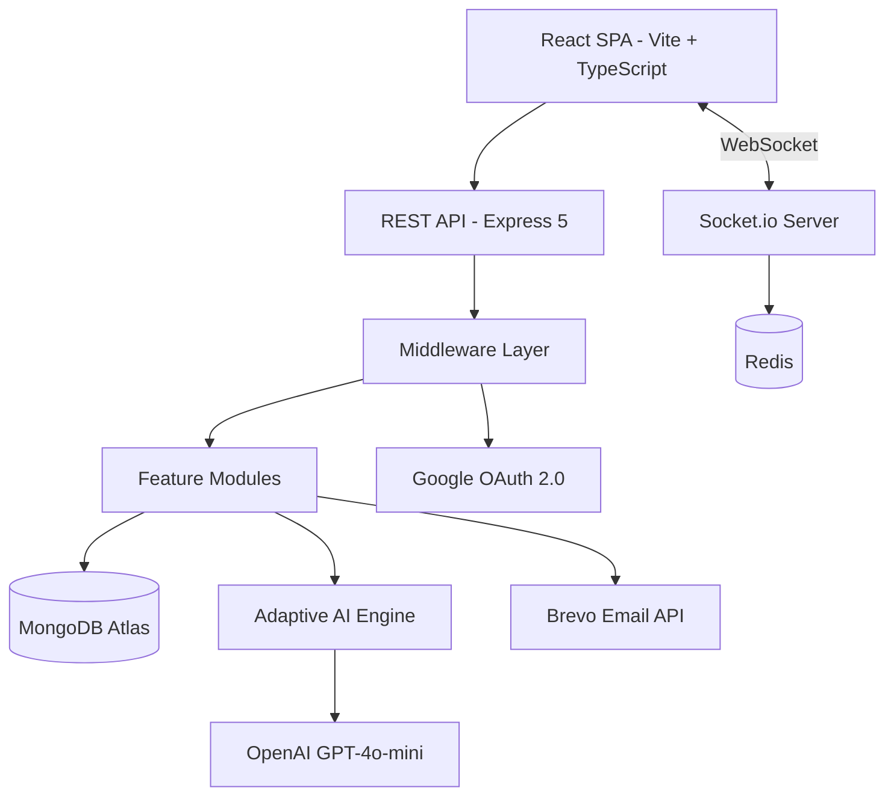

---

**Architectural reasoning:** The monorepo structure was chosen over microservices because the team size and deployment requirements favor simplicity. Both apps share TypeScript and can be deployed independently — the client to Vercel's edge network, the server to Render's Node.js runtime. Redis bridges the two for real-time features, and MongoDB Atlas provides a fully managed, horizontally scalable data layer.

---

## Frontend Architecture

The client is a React 18 SPA built with Vite 5 and TypeScript. UI is composed from shadcn/ui (Radix UI primitives + Tailwind CSS) with a custom design token layer.

### Component Hierarchy

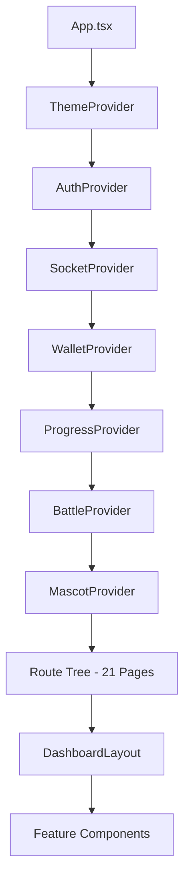

---

### State Management Strategy

| Layer | Technology | Responsibility |
|---|---|---|
| **Server State** | TanStack React Query v5 | API data fetching, caching, background refetch |
| **Auth State** | React Context (`AuthContext`) | JWT token, user profile, login/logout |
| **Real-Time State** | React Context (`SocketContext`, `BattleContext`) | WebSocket connection, battle state machine |
| **Domain State** | React Context (`WalletContext`, `ProgressContext`) | Wallet balance, learning progress |
| **UI State** | React Context (`MascotContext`) + `next-themes` | Mascot interactions, dark/light theme |
| **Form State** | React Hook Form + Zod v3 | Form validation with schema-driven rules |

**Design decision:** React Context was chosen over Redux or Zustand because the state domains are well-isolated with minimal cross-cutting concerns. TanStack Query handles the most complex state (server data) with built-in caching, deduplication, and background refetch — eliminating the need for a global store.

### Client Directory Map

```
src/
├── components/ui/       # 30+ shadcn/ui primitives (Button, Dialog, Card, etc.)
├── components/mascot/   # Rupi AI companion (SVG states + sound engine)
├── contexts/            # 6 React Context providers
├── features/            # Feature-scoped components (auth, battle, learning, wallet)
├── hooks/               # Custom hooks (useToast, useMobile, useSound)
├── layouts/             # DashboardLayout + NavLink
├── lib/                 # Utility (cn, sounds engine)
├── pages/               # 21 route pages
├── services/            # API client (auto-injects JWT) + Socket.io service
└── types/               # Shared TypeScript interfaces
```

---

## Backend Architecture

The server follows a **modular monolith** pattern. Each domain feature is encapsulated in its own module with a consistent internal structure.

### Module Pattern

Every feature module in `server/src/modules/<feature>/` follows this convention:

```
<feature>/
├── <feature>.controller.ts    # Route handlers (thin — delegates to service)
├── <feature>.service.ts       # Business logic (pure functions where possible)
├── <feature>.routes.ts        # Express Router with middleware chain
├── <feature>.schema.ts        # Zod validation schemas
├── <feature>.socket.ts        # Socket.io event handlers (battle modules only)
└── <feature>.types.ts         # TypeScript interfaces (optional)
```

### Module Dependency Map

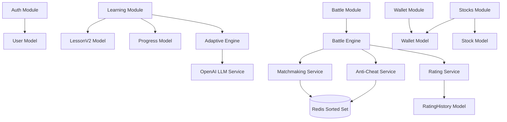

---

### Middleware Pipeline

Every incoming HTTP request passes through a standardized middleware chain:

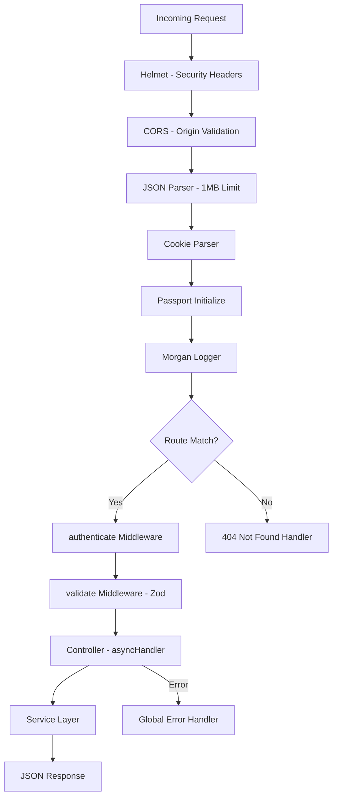

---

**Engineering reasoning:** The `asyncHandler` wrapper catches all rejected promises from async controllers and forwards them to the global error handler. This eliminates the need for try-catch blocks in individual route handlers. The `ApiError` class provides typed HTTP error codes that the error handler maps to consistent JSON responses.

---

## Database Design

MongoDB Atlas is used with Mongoose 8 as the ODM layer. The schema design prioritizes **read performance** and **document locality** — embedding frequently accessed data within the parent document to minimize join-like queries.

### Data Model Relationships

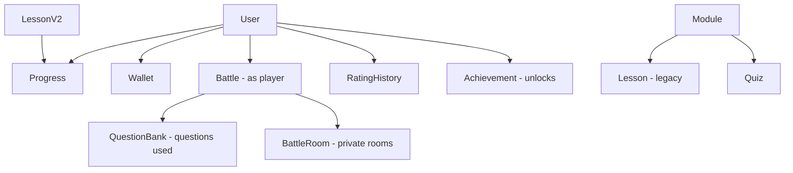

---

### Core Models (14 total)

| Model | Purpose | Key Fields |
|---|---|---|
| **User** | User account + gamification state | `eloRating`, `battleStats`, `presenceStatus`, `learningProfile`, `xp`, `level` |
| **Progress** | Per-user learning telemetry | `completedLessons`, `topicAccuracy`, `timeTaken`, `xpEarned` |
| **LessonV2** | Adaptive step-based lessons | `steps[]` (info + MCQ), `topic`, `difficulty`, `order` |
| **Battle** | Persisted battle record | `players[]`, `questions[]`, `answers[]`, `scores`, `eloChanges`, `winner` |
| **BattleRoom** | Private room with 6-char code | `code`, `host`, `guest`, `config`, `expiresAt` (TTL index) |
| **QuestionBank** | MCQ pool for battles | `topic`, `difficulty`, `options[]`, `correctAnswer`, `explanation` |
| **RatingHistory** | ELO change log per battle | `userId`, `battleId`, `ratingBefore`, `ratingAfter`, `change` |
| **Wallet** | Virtual currency ledger | `totalEarned`, `discretionary`, `expenses`, `transactions[]` |
| **Stock** | Simulated stock data | `symbol`, `name`, `price`, `history[]`, `sector` |
| **Achievement** | Achievement definitions | `title`, `description`, `criteria`, `xpReward` |
| **Module** | Learning module grouping | `title`, `description`, `order`, `lessonCount` |
| **Lesson** | Legacy slide-based lessons | `moduleId`, `slides[]`, `order` |
| **Quiz** | Module-level quizzes | `moduleId`, `questions[]` |
| **Testimonial** | Student testimonials | `name`, `age`, `text`, `avatar` |

### Indexing Strategy

| Collection | Index | Type | Purpose |
|---|---|---|---|
| `User` | `email` | Unique | Login lookup |
| `User` | `eloRating` | Descending | Leaderboard queries |
| `BattleRoom` | `expiresAt` | TTL (5 min) | Auto-delete expired rooms |
| `QuestionBank` | `topic + difficulty` | Compound | Adaptive question selection |
| `Battle` | `players + createdAt` | Compound | Battle history pagination |

---

## AI Processing Pipeline

The AI layer consists of two subsystems: the **Adaptive Lesson Engine** and the **LLM Question Generator**.

### Adaptive Lesson Selection

The server dynamically selects the next lesson based on the user's cumulative performance profile. This runs entirely server-side — the client never sees the selection logic.

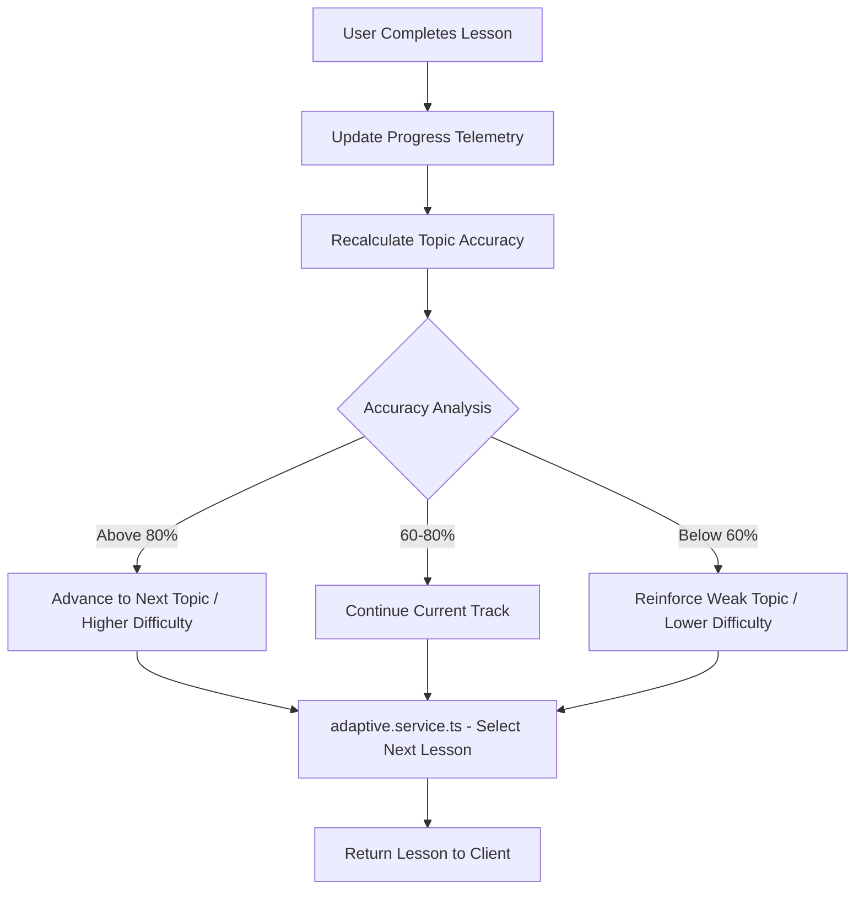

---

**Key telemetry signals:**

- **Accuracy** — Percentage of correct MCQ answers per topic
- **Response time** — Average time per question (indicates confidence)
- **Topic coverage** — Tracks which topics the user has encountered
- **Weak/strong topics** — Derived from per-topic accuracy thresholds

### LLM Question Generation

When the question pool for a given topic and difficulty drops below 20 questions, the system triggers automatic generation via OpenAI GPT-4o-mini.

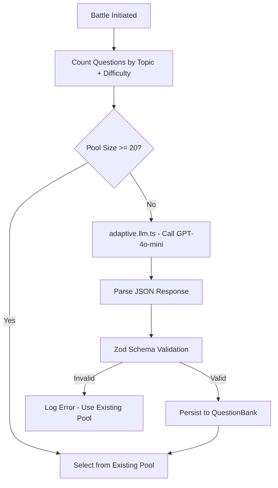

---

**Engineering reasoning:** Zod validation on LLM output is critical because language model responses are non-deterministic. The schema enforces structure (correct answer index, option count, difficulty label) before any data is persisted. Failed validations fall back to the existing pool — the system never blocks a battle due to LLM errors.

---

## Real-Time Battle System

The battle system is the most architecturally complex subsystem. It spans 5 server modules (`battle`, `matchmaking`, `room`, `anticheat`, `rating`, `presence`) and operates entirely over WebSocket.

### Battle Lifecycle

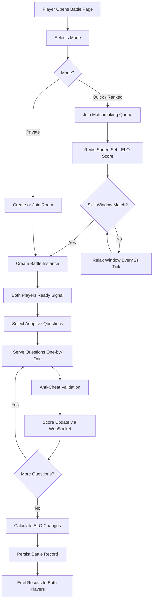

---

### Matchmaking Algorithm

The matchmaking system uses a **Redis sorted set** with a composite score combining ELO rating and user level:

```
Score = (ELO × 1000) + level
```

A background tick runs every **2 seconds**, scanning the queue for players within a skill window. The window starts narrow and **relaxes over time** to prevent indefinite waiting:

| Time in Queue | Skill Window (ELO range) |
|---|---|
| 0–10s | ±50 |
| 10–30s | ±100 |
| 30–60s | ±200 |
| 60–120s | ±500 |
| 120s+ | Timeout — player removed from queue |

### ELO Rating System

Standard ELO formula with **dynamic K-factor**:

| Player Category | K-Factor | Condition |
|---|---|---|
| New Player | K = 40 | < 30 battles |
| Standard | K = 32 | 30+ battles, ELO < 2400 |
| Elite | K = 16 | ELO ≥ 2400 |

**Mode multipliers** — battle mode affects ELO impact:

| Mode | Multiplier |
|---|---|
| Ranked | 1.0× (full impact) |
| Quick Match | 0.5× (half impact) |
| Private Room | 0.25× (quarter impact) |

### Anti-Cheat Architecture

All anti-cheat operations are **Redis-backed** for atomicity and speed:

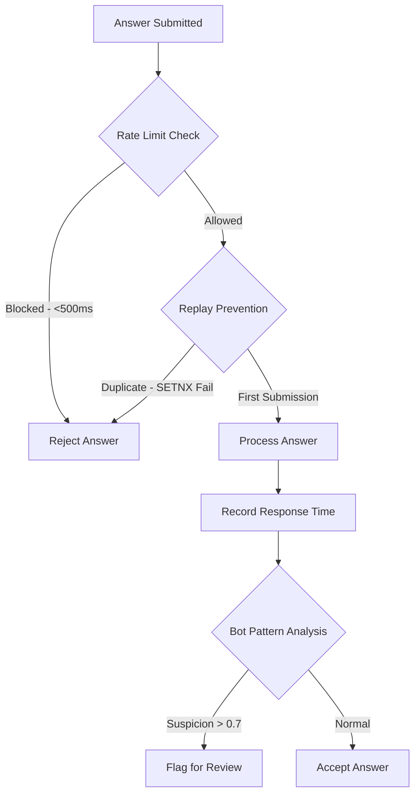

---

| Layer | Mechanism | Redis Key Pattern | TTL |
|---|---|---|---|
| **Rate Limiting** | Max 1 answer per 500ms per user | `anticheat:rate:{userId}` | 500ms |
| **Replay Prevention** | SETNX lock per question per user | `anticheat:answer:{roomId}:q{idx}:u{userId}` | 60s |
| **Tab Switch Tracking** | Event list per user per battle | `anticheat:tabswitch:{battleId}:{userId}` | 1 hour |
| **Bot Detection** | Response time variance analysis | In-memory (per battle) | Battle duration |

**Design decision:** The system uses a **fail-open** strategy — if Redis is unavailable, anti-cheat checks pass through rather than blocking gameplay. This ensures Redis outages degrade monitoring, not availability.

---

## Caching Strategy

Redis serves three distinct roles in the architecture:

| Role | Implementation | Data |
|---|---|---|
| **Socket.io Adapter** | `@socket.io/redis-adapter` with dedicated pub/sub clients | Cross-instance WebSocket message delivery |
| **Matchmaking Queue** | Redis sorted set with composite ELO score | Player queue with rank-ordered matching |
| **Anti-Cheat Store** | SETNX locks, rate-limit keys, event lists | Answer deduplication, rate limiting, tab tracking |

### Redis Connection Architecture

The server maintains **3 separate Redis connections** to isolate concerns:

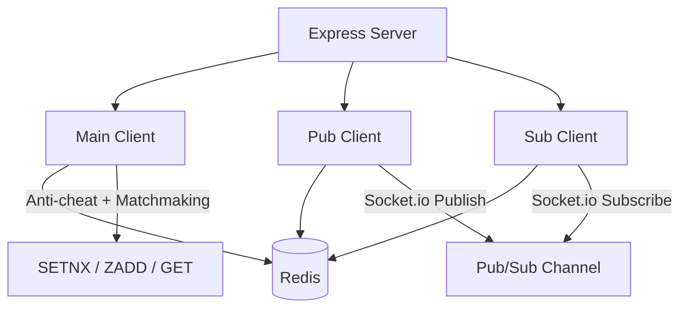

---

**Engineering reasoning:** Socket.io's Redis adapter requires dedicated pub/sub connections that must not be shared with the main application client. Using separate connections prevents pub/sub blocking from affecting matchmaking or anti-cheat operations.

---

## Authentication Flow

MoneyMaster supports two authentication methods: **OTP-based email verification** and **Google OAuth 2.0**.

### OTP Flow

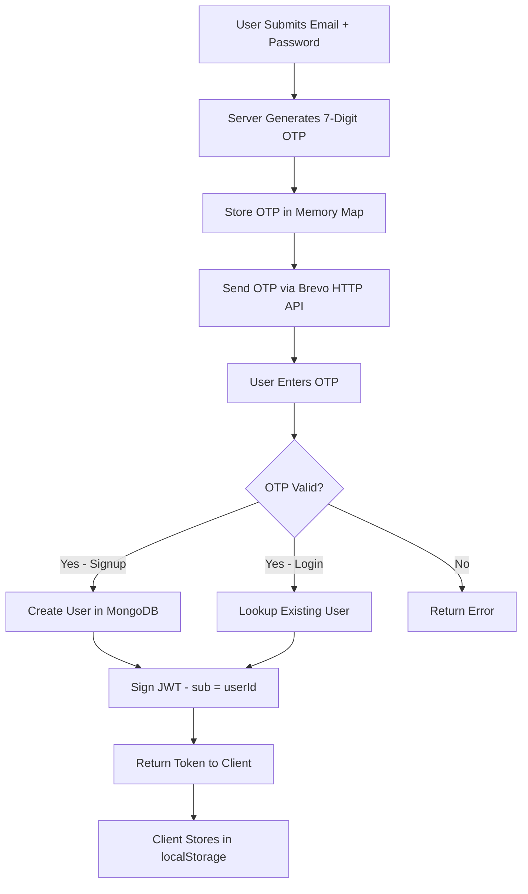

---

### Google OAuth Flow

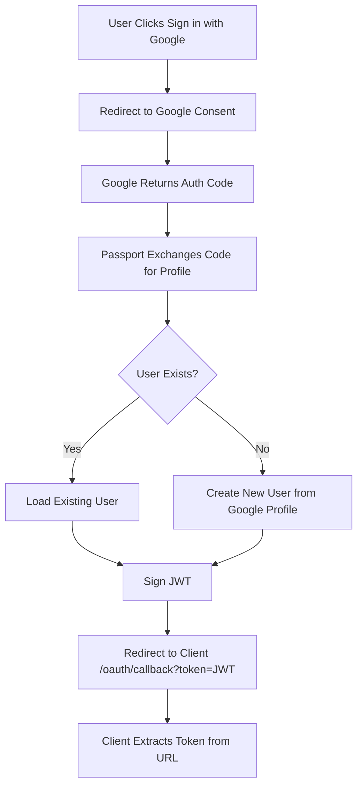

---

### JWT Structure

| Claim | Value |
|---|---|
| `sub` | User's MongoDB ObjectId |
| `iat` | Issued-at timestamp |
| `exp` | Expiration (default: 7 days) |

Token verification occurs in two middleware layers:
- **REST:** `authenticate` middleware extracts from `Authorization: Bearer <token>` header
- **WebSocket:** `socketAuthMiddleware` extracts from `auth.token` in the Socket.io handshake

---

## API Request Lifecycle

Every API request follows a deterministic path through the middleware stack:

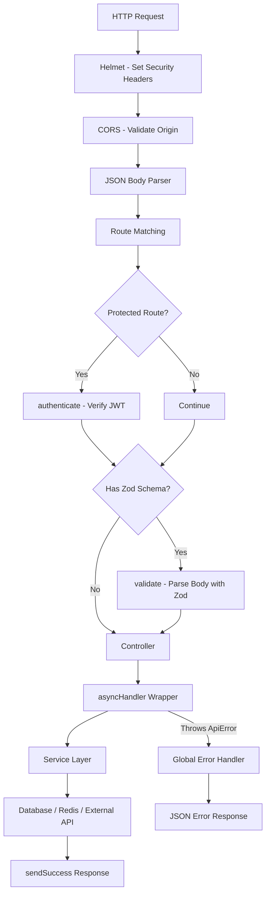

---

## Deployment Architecture

### Infrastructure Topology

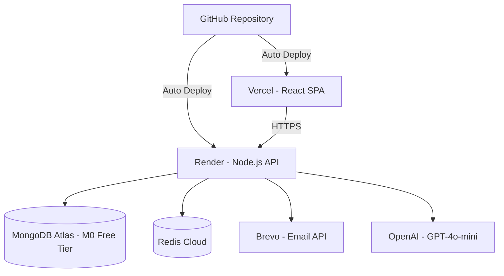

---

### Platform Mapping

| Component | Platform | Configuration |
|---|---|---|
| **Frontend** | Vercel | Auto-deploy from `main`. `vercel.json` rewrites all routes to `index.html` for SPA routing. |
| **Backend** | Render | Node.js service. Build: `npm run build` → Start: `npm run start`. Environment variables configured in Render dashboard. |
| **Database** | MongoDB Atlas | Free M0 tier. Connection via `MONGODB_URI` with TLS. |
| **Cache** | Redis Cloud | Persistent instance. 3 connections: main + pub + sub. |
| **Email** | Brevo | HTTP API (not SMTP — Render blocks outbound SMTP on ports 25, 465, 587). |
| **AI** | OpenAI | GPT-4o-mini for question generation. Usage is optional and metered. |

### CI/CD Workflow

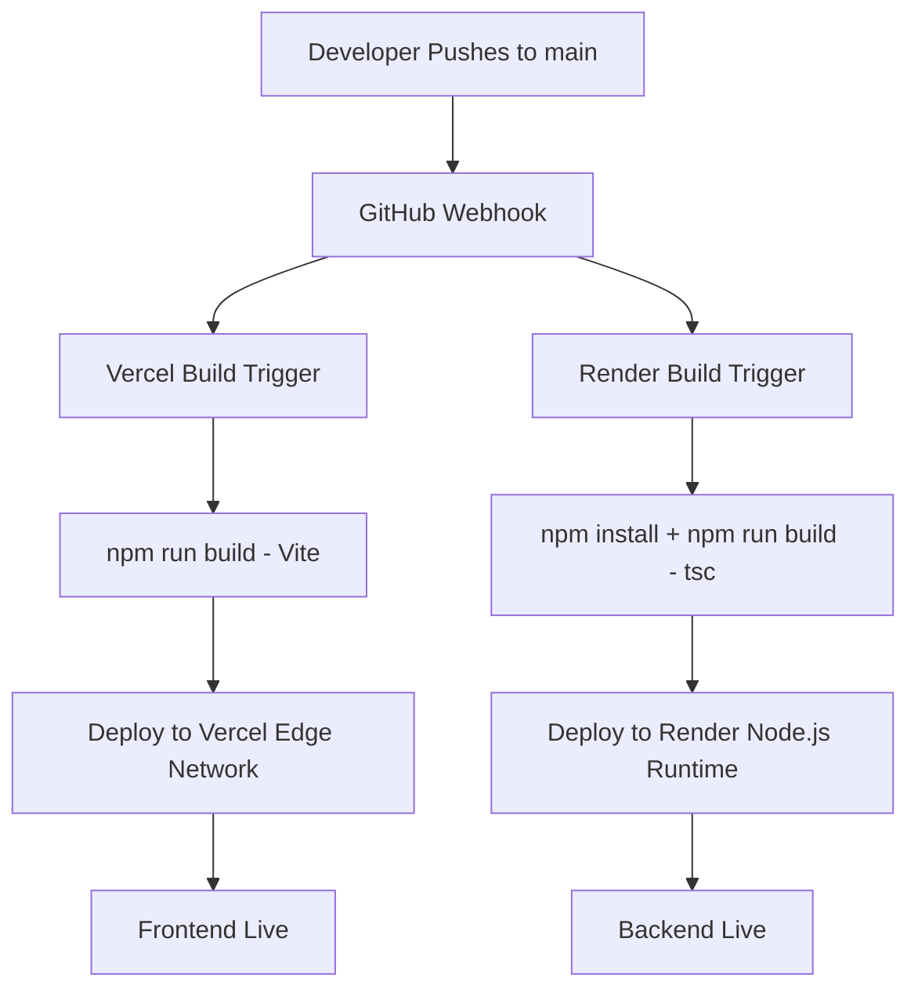

---

**Design decision:** Brevo's HTTP API was chosen over SMTP because Render blocks outbound SMTP ports in their free and starter tiers. The HTTP API approach is also more resilient — it doesn't require maintaining persistent SMTP connections and supports built-in retry logic.

---

## Monitoring & Logging

### Logging Architecture

| Component | Tool | Format |
|---|---|---|
| **Server** | Pino + pino-pretty | Structured JSON in production, pretty-printed in development |
| **HTTP Access** | Morgan | `combined` format in production, `dev` format in development |
| **Client** | Browser console | Development only |

All server-side logs use the Pino logger (`utils/logger.ts`). Direct `console.log` calls are prohibited — enforced by code convention.

### Log Levels

| Level | Usage |
|---|---|
| `fatal` | Unrecoverable errors requiring immediate attention |
| `error` | Operation failures (Redis disconnect, LLM errors, DB write failures) |
| `warn` | Degraded state (reconnection attempts, fallback paths taken) |
| `info` | Significant events (server start, socket connections, battle completions) |
| `debug` | Detailed tracing (socket auth, adaptive selection logic) |

### Health Monitoring

The server exposes a `GET /health` endpoint that returns:

```json
{
  "status": "ok",
  "timestamp": "2025-06-01T10:30:00.000Z"
}
```

This endpoint is unauthenticated and suitable for load balancer health checks and uptime monitoring services.

---

## Security Architecture

### Defense Layers

| Layer | Mechanism | Implementation |
|---|---|---|
| **Transport** | HTTPS (TLS) | Enforced by Vercel and Render |
| **Headers** | Helmet.js | Sets `X-Content-Type-Options`, `X-Frame-Options`, `Strict-Transport-Security`, etc. |
| **Origin** | CORS whitelist | Only `CLIENT_URL` and `localhost` variants are permitted |
| **Authentication** | JWT (HS256) | 256-bit secret, 7-day expiry, bearer token scheme |
| **Authorization** | `authenticate` middleware | Per-route enforcement, user loaded from DB on every request |
| **Input Validation** | Zod schemas | All request bodies, params, and queries are validated before processing |
| **Password Storage** | bcryptjs | Salted hashing with adaptive cost factor |
| **Anti-Cheat** | Redis SETNX + rate limiting | Atomic locks prevent replay attacks; 500ms cooldown prevents spam |
| **Payload Limits** | Express `json({ limit: '1mb' })` | Prevents oversized request payloads |
| **Socket Auth** | JWT in handshake `auth.token` | Every WebSocket connection requires valid JWT |

### Password Policy

Enforced by Zod schema on both signup and password change:

- Minimum 8 characters, maximum 128
- At least 1 uppercase letter
- At least 1 lowercase letter
- At least 1 digit
- At least 1 special character

---

## Scalability Considerations

### Current Limitations

| Component | Constraint | Impact |
|---|---|---|
| **OTP Store** | In-memory `Map` | Lost on server restart; single-instance only |
| **BattleEngine** | In-memory state | Active battles lost on restart; single-instance only |
| **Redis** | Single instance assumed | Adequate for current load; no clustering |
| **MongoDB** | Free M0 tier | 512 MB storage limit, shared cluster |

### Horizontal Scaling Readiness

| Component | Scalability | Notes |
|---|---|---|
| **Frontend** | Fully scalable | Vercel edge network handles CDN distribution globally |
| **Socket.io** | Horizontally scalable | Redis adapter enables multi-instance WebSocket delivery |
| **REST API** | Stateless (mostly) | JWT auth is stateless; OTP store is the exception |
| **MongoDB** | Atlas auto-scaling | Upgrade from M0 to M10+ for dedicated resources |
| **Redis** | Cloud-managed | Redis Cloud supports clustering and replicas |

---

## Future Scalability Plans

The following enhancements are planned for production scale:

| Enhancement | Description | Priority |
|---|---|---|
| **OTP Migration** | Move OTP store from in-memory `Map` to Redis with TTL | High |
| **Battle State Persistence** | Persist active battle state to Redis for crash recovery | High |
| **API Rate Limiting** | Global rate limiting via `express-rate-limit` + Redis store | Medium |
| **Queue System** | Background job queue (BullMQ) for email, LLM calls, analytics | Medium |
| **Test Suite** | Unit + integration tests with Vitest (client) and Jest (server) | Medium |
| **Database Indexes** | Profiling-driven index optimization as data grows | Medium |
| **CDN Assets** | Offload static assets to Cloudflare or S3 + CloudFront | Low |
| **Observability** | Integrate Sentry for error tracking + Prometheus metrics | Low |
| **Federation** | Research federated learning pipeline for cross-institution analytics | Research |

---

<div align="center">

**MoneyMaster Architecture v1.0** · [Live Platform](https://finlearnplat.vercel.app) · [API Docs](./API_DOCUMENTATION.md) · [GitHub](https://github.com/AneeshaNigam/Gamified_Financial_Learning_Platform)

</div>
